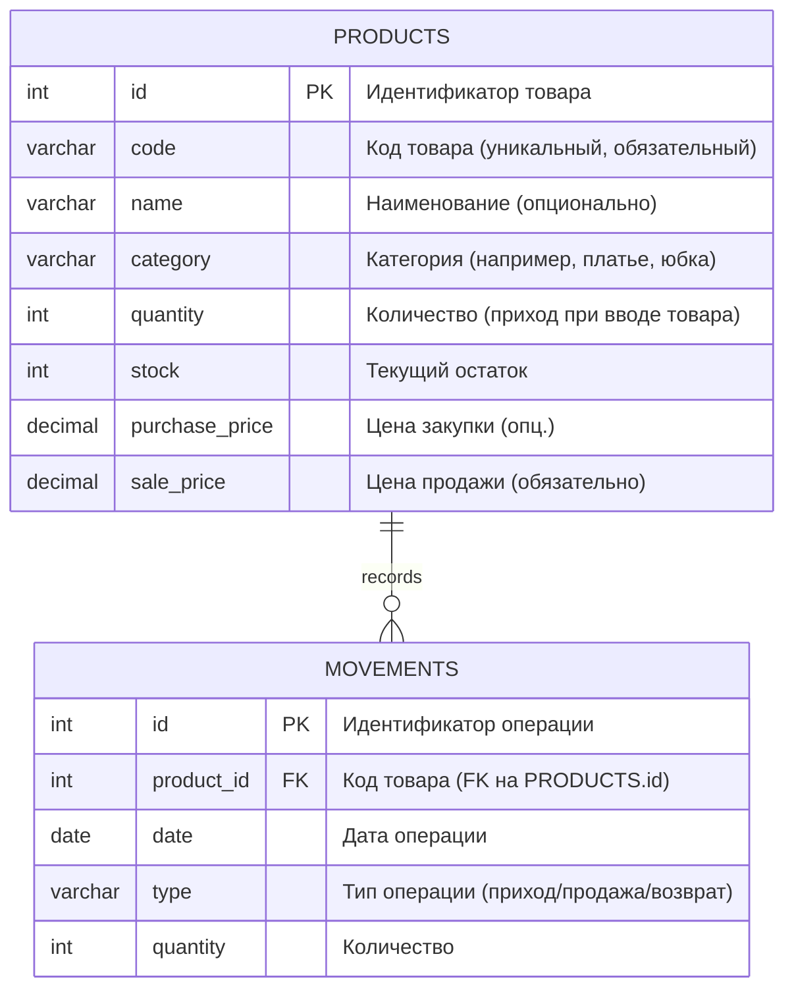

# Краткое содержание  
Проект **минимального приложения учёта одежды** (платья, юбки, футболки, штаны и т.д.) для бутика предполагает лёгкую и быструю реализацию базовых функций: добавление/удаление товара, поиск по коду/наименованию, учёт прихода/продажи/возврата, отчёты по остаткам и движениям. Обязательные поля товара – код (уникальный), количество, остаток, цена продажи; необязательные – наименование, цена закупки, размер, цвет (зарезервированы на будущее).  

В ответе приведена подробная структура данных (ER-диаграмма в формате Mermaid и схема БД с типами полей и ограничениями), REST API для операций с товарами и движениями, прототипы экранов UI/UX (включая мобильную версию), сравнительная таблица технологий (backend, frontend, БД), план разработки с этапами и оценкой сроков (MVP), тестовые сценарии (проверка корректности остатков) и рекомендации по резервному копированию, импорту/экспорту и разграничению прав (админ/продавец). Также приведён список рисков проекта и способы их минимизации. Всё изложено аналитично, с примерами запросов/ответов и ссылками на авторитетные источники (официальная документация, статьи и публикации на русском).  

## Требования к учёту и структура данных  
Минимальный набор полей товара: **код** (string, PK, уникальный, обязательный), **количество** (int), **остаток** (int) и **цена продажи** (decimal). Дополнительно возможны: наименование, цена закупки, размер, цвет (optional). Для учёта движений операций введём таблицу «Движения» (операции прихода/продажи/возврата), где фиксируется код товара, дата и тип операции («приход», «продажа», «возврат»), а также количество. Один к товару может быть много операций (**связь «один-ко-многим»**).  

### ER-диаграмма (Mermaid)  
В следующем примере наглядно показана сущность `PRODUCTS` (товары) и связанная с ней сущность `MOVEMENTS` (движения товаров). Отношение между ними – один товар может иметь много движений (crow’s foot notation). Поля (атрибуты) указаны с типами и примечаниями:  



*Примечание:* Mermaid позволяет включать атрибуты сущностей с их типами для ясности. Связь `PRODUCTS ||--o{ MOVEMENTS` означает «один товар – много операций», где «||» – «ровно один», «o{» – «ноль или многие».  

### Схема БД (пример)  
На основании ER-диаграммы можно спроектировать реляционные таблицы. Например, для PostgreSQL или MySQL:  

- **Таблица `products`**:  
  - `id SERIAL PRIMARY KEY` – автоинкрементный идентификатор.  
  - `code VARCHAR(50) UNIQUE NOT NULL` – уникальный код товара.  
  - `name VARCHAR(100) NULL` – наименование (может быть NULL).  
  - `category VARCHAR(50) NULL` – категория товара (text).  
  - `quantity INT NOT NULL DEFAULT 0` – начальное количество (при создании записи).  
  - `stock INT NOT NULL DEFAULT 0` – текущий остаток.  
  - `purchase_price DECIMAL(10,2) NULL` – закупочная цена (опционально).  
  - `sale_price DECIMAL(10,2) NOT NULL` – цена продажи.  

  Ограничения: `code` – уникален (`UNIQUE`), `name` и `category` не обязательны (могут быть пустыми).  

- **Таблица `movements`**:  
  - `id SERIAL PRIMARY KEY` – идентификатор операции.  
  - `product_id INT NOT NULL` – внешний ключ на `products(id)`.  
  - `date DATE NOT NULL` – дата операции.  
  - `type VARCHAR(10) NOT NULL` – тип операции: «приход», «продажа» или «возврат».  
  - `quantity INT NOT NULL` – количество.  

  Ограничения: `product_id` – FK на `products(id)`. Логика приложения должна предотвращать создание операций со скоростью приводящей к отрицательному `stock`.  

При поступлении нового товара (`type = 'приход'`) в `movements` происходит увеличение `stock` соответствующего товара, при продаже (`'продажа'`) – уменьшение, при возврате (`'возврат'`) – увеличение. Поле `quantity` в `products` можно использовать для инициализаций или вспомогательно, но главное – актуальный `stock`.  

## REST API (эндпойнты и примеры)  
Серверная часть реализует **REST API** с JSON-запросами. Каждый ресурс (товар, движение) имеет свой URL и HTTP-методы (CRUD).  

### Эндпойнты продуктов (/products)  
- `GET /api/products` – список всех товаров (можно добавить параметры фильтрации: по коду, наименованию, категории, наличию и т.д.).  
- `GET /api/products/{code}` – получить товар по коду (или по ID).  
- `POST /api/products` – создать новый товар. Тело JSON:  
  ```json
  {
    "code": "SKIRT001",
    "name": "Лёгкая юбка",
    "category": "Юбки",
    "quantity": 10,
    "sale_price": 1500.00
  }
  ```  
  *Ответ:* JSON с подтверждением и данными новой записи (например, с присвоенным `id`). Код HTTP 201 или 200.  
- `PUT /api/products/{code}` или `PATCH /api/products/{code}` – обновить данные товара. Пример запроса для изменения цены и остатка:  
  ```json
  {
    "sale_price": 1600.00,
    "stock": 12
  }
  ```  
- `DELETE /api/products/{code}` – удалить товар (если `stock = 0`; если остаток не нулевой, стоит либо запретить, либо требовать предварительного обнуления).  

### Эндпойнты движений (/movements)  
- `GET /api/movements` – список всех операций (или фильтр по коду товара, по дате, по типу).  
- `GET /api/movements?product=SKIRT001` – список операций по конкретному товару.  
- `POST /api/movements` – создать запись о движении товара. Пример тела:  
  ```json
  {
    "product_code": "SKIRT001",
    "type": "продажа",
    "quantity": 3,
    "date": "2026-07-04"
  }
  ```  
  При поступлении `type="приход"` `stock` товара увеличится, при `type="продажа"` уменьшится (проверка, чтобы `stock` не ушёл отрицательным), при `type="возврат"` – увеличится.  
  *Ответ:* JSON с новой операцией и обновлённым остатком товара.  

- `DELETE /api/movements/{id}` – отмена операции (по ID); в этом случае нужно в обратном порядке скорректировать `stock`.  

### Примеры запросов/ответов  
**Создание товара:**  
```http
POST /api/products
Content-Type: application/json

{"code":"DRESS001","name":"Летнее платье","category":"Платья","quantity":5,"sale_price":2000.00}
```  
*Ответ (200 OK):*  
```json
{"id": 1, "code": "DRESS001", "stock": 5, "sale_price": 2000.00}
```  

**Продажа товара:**  
```http
POST /api/movements
Content-Type: application/json

{"product_code":"DRESS001","type":"продажа","quantity":2,"date":"2026-07-04"}
```  
*Ответ:*  
```json
{"id": 101, "product_code": "DRESS001", "type": "продажа", "quantity": 2, "date": "2026-07-04", "new_stock": 3}
```  

**Получение отчёта по остаткам:**  
```http
GET /api/products?in_stock=true
```  
*Ответ:* массив товаров с `stock > 0`.  

*(Примечание: в REST-API ресурсы «products» и «movements» реализуются через стандартные HTTP-методы; например, **GET** для чтения, **POST** для создания, **PUT/PATCH** – для обновления, **DELETE** – для удаления.)*  

## UI/UX (макеты экранов)  
Интерфейс приложения должен быть **простым и понятным**. Главный экран – список товаров с их кодами, категориями и остатками. Поля для быстрого добавления товара можно вывести в виде формы или всплывающего окна: код, количество, цена. Ниже – кнопки действий: «Добавить товар», «Продать товар», «Вернуть товар». Есть строка поиска по коду/наименованию (автодополнение) и фильтры (по категории, только в наличии и т.п.).  

Для **мобильной версии** использовать адаптивный дизайн: крупные кнопки («+ товар», «Продажа») на нижней панели, поиск сверху. Форма добавления должна выводиться в полноэкранном модальном окне. В таблице остатков можно скрывать ненужные колонки или сделать вертикальный список карточек товара.  

*Макеты и примеры UI:* (здесь представлены концептуальные блок-схемы и простые скетчи, иллюстрирующие идею расположения элементов).  

```mermaid
flowchart LR
    Main[Главное меню] --> Goods[Товары]
    Main --> In[Поступление товара]
    Main --> Out[Продажа товара]
    Main --> Stats[Отчёты]
    Goods --> Search["Поле поиска по коду/наименованию"]
    Goods --> List["Список товаров (код, категория, остаток)"]
    Out --> SellForm["Форма продажи (код, кол-во)"]
    In --> InForm["Форма прихода (код, кол-во)"]
    ```
  
*Комментарий:* На схеме показан простой пользовательский поток. Главные разделы: **Товары**, **Поступления**, **Продажи**, **Отчёты**. В разделе «Товары» – поисковая строка и таблица остатков. Формы «Приход» и «Продажа» вызываются по кнопкам, содержат поля для кода товара и количества. В мобильной версии эти элементы располагаются вертикально (главное меню – свернутое или скрытое за «гамбургером»; быстрые действия выведены в нижней панели).  

(Внимание: приведён упрощённый макет; более детальные прототипы можно нарисовать в Figma/Sketch. Например, установка фокуса на код товара ускоряет ввод; поля в форме можно переставлять для удобства.)  

## Технологический стек (сравнение)  
Для быстрой и лёгкой реализации подходят популярные фреймворки с хорошей документацией. Ниже — сравнительная таблица основных вариантов.  

| Компонент       | Опция/Технология              | Плюсы                                              | Минусы                                           |
|-----------------|-------------------------------|----------------------------------------------------|--------------------------------------------------|
| **Backend**     | **Node.js + Express/NestJS**  | Широкое сообщество, лёгкий запуск (npm), JavaScript по всей стеке. | Не самая строгая типизация (если без TypeScript), высокая нагрузка CPU. |
|                 | **Python + FastAPI/Flask**    | Быстрота разработки, синтаксис Python, встроенная поддержка OpenAPI (FastAPI). | Сложнее деплоить на Windows-серверах (обычно Linux лучше). |
|                 | **PHP + Laravel/Lumen**       | Простота хостинга (много готовых тарифов), зрелый фреймворк, шаблоны Blade (Laravel). | Может быть избыточен для очень простого MVP; старое имя (Laravel) не означает сложность. |
|                 | **Ruby on Rails**             | «Из коробки» готовы схема БД, CRUD, формирование API и UI. | Меньше специалистов, ресурсоёмкий. |
| **Frontend**    | **React**                     | Универсальность, обширная экосистема, PWA.         | Крутая кривая обучения для новичка, большой размер сборки. |
|                 | **Vue.js**                    | Прост в освоении, лёгкий вес, хорош для форм и таблиц. | Меньшее сообщество, менее «корпоративный» (но растёт). |
|                 | **Angular**                   | Полный фреймворк (Forms, Routing, CLI), TypeScript. | Затратно для простого проекта (болтовни много).  |
|                 | **Vanilla JS + HTML/CSS**     | Нулевой оверхед, работает везде, не требует сборки. | Меньше современных удобств (State, Routing), ручная работа. |
| **База данных** | **SQLite**                    | Лёгкая встраиваемая БД, не нужен отдельный сервер, хранится в одном файле. Быстрое развёртывание для малого приложения. | Не подходит для масштабирования, однопользовательские замки (но для MVP ок). |
|                 | **PostgreSQL/MySQL**          | Надёжные СУБД, ACID, хорошо масштабируются.        | Нужно настроить сервер/доступ, чуть дольше запуск. |
|                 | **MongoDB (NoSQL)**           | Гибкая модель данных (JSON-документы), проста в масштабировании. | Избыточно для фиксированных сущностей; нет транзакций по умолчанию. |

**Рекомендация:** для MVP быстро использовать **Node.js + Express** (JavaScript-все-все) с **SQLite** или **MySQL**. Express прост и хорошо документирован, легко развернуть на любом хостинге. SQLite позволит не тратить время на администрирование СУБД (данные в одном файле).  
Для интерфейса – можно обойтись чистым HTML+Bootstrap+Vanilla JS (максимально быстро) или выбрать **Vue.js** (простой и лёгкий для форм).  

## План разработки (этапы и сроки)  
Ниже примерный разбив этапов разработки с фокусом на MVP (минимально жизнеспособный продукт). Сроки указаны в рабочих днях (при команде 1–2 человека), ориентир **1–2 месяца** разработки для MVP с основными функциями.  

| Этап | Описание работ                                     | Сроки (раб.дни) | Приоритет |
|------|----------------------------------------------------|---------------|-----------|
| 1    | Формулирование требований, создание ER-диаграммы, проект схемы БД, прототипов UI (бумажные или в Figma) | 2–3           | Критичный (MVP) |
| 2    | Настройка проекта, окружения, базового каркаса (инициализация репозитория, Docker/сервер, CI/CD) | 1–2           | Критичный |
| 3    | Реализация API для CRUD товаров (Endpoints `/products`) и привязка к БД. Проведение unit-тестов на модели данных. | 3–5           | Критичный |
| 4    | Реализация UI: формы и страницы для добавления/списка товаров, AJAX-запросы к API. Поиск по коду/имени. | 3–4           | Критичный |
| 5    | Учёт движений: таблица `movements`, API для прихода/продажи, обновление поля `stock`. Проверка безоткатности (т.е. блокировка `stock >= 0`). | 3–4           | Критичный |
| 6    | Раздел «Отчёты»: отчёты по остаткам (все товары с `stock`), отчёты по продажам/приходам за период. | 2–3           | Средний |
| 7    | Авторизация/роли: добавить минимум два типа пользователей (админ, продавец) и механизм входа (JWT или сессии). Управление правами (напр., продавец не может удалять товары). | 2–3           | Средний |
| 8    | Тестирование и отладка: функциональные и регрессионные тесты, проверка целостности остатков (сценарии ниже). | 2–3           | Критичный |
| 9    | Документация: README, инструкция по развёртыванию, схема БД, примеры API (аннотация OpenAPI по возможности). | 1–2           | Средний |
| 10   | Подготовка к релизу: настройка бэкапов, механизм импорта/экспорта CSV/Excel, финальные проверки. | 2–3           | Средний |

*MVP включает пункты 1–5. Отчёты, роли, экспорт и т.д. можно добавить после ввода в эксплуатацию или как «v2».*  

## Тестовые сценарии и проверки целостности остатков  
Тесты должны проверить все основные сценарии работы с товарами и движениями:  
- **Добавление товара:** создать товар с уникальным кодом и ненулевым количеством, проверить, что он появился в списке и `stock` правильно установлен. Создание дубликата кода должно приводить к ошибке (уникальность).  
- **Изменение товара:** изменение цены и параметров не влияет на остаток.  
- **Продажа товара:** вызвать продажу товара с количеством ≤ текущего `stock`; после операции проверить, что `stock` уменьшился на это количество. Если попытаться продать больше, чем есть на складе, система должна выдать ошибку и не изменить `stock`.  
- **Приход товара:** увеличить `stock` указанной величиной.  
- **Возврат товара:** при возврате увеличить `stock`, как при приходе.  
- **Удаление товара:** удалить товар можно только если `stock = 0` (либо требовать явного обнуления остатка). После удаления проверять, что он удалён из БД (используя GET по коду).  
- **Целостность остатков:** после серии операций приход/продажа/возврат для каждого товара `stock = sum(приходы + возвраты) – sum(продажи)`. (Можно автоматически проверять это равенство как тест, используя данные из таблицы `movements`.)  
- **Отчёты:** отчёты по остатку должны учитывать только не удалённые товары. Отчёты по операциям за период должны правильно суммировать количество.  
- **Роли/доступ:** продавец без прав админа не может изменить настройки товара (например, цену или удалить товар).  

Каждый сценарий стоит автоматизировать (unit/ интеграционные тесты) и прогонять при каждом изменении, чтобы исключить регрессии.  

## Резервное копирование, импорт/экспорт, права доступа  
- **Резервное копирование:** если используется **SQLite**, достаточно копировать файл БД (например, по ночному расписанию) – простейшая стратегия. Если **PostgreSQL/MySQL** – настроить утилиты `pg_dump` или `mysqldump` с периодическими бэкапами. Хранить резервные копии вне продакшн-сервера (облако, внешний диск).  
- **Импорт/экспорт:** предоставить пользователю возможность **импортировать CSV/Excel** для первоначальной загрузки товаров. Формат: первая строка – имена полей (`code, name, category, quantity, sale_price` и т.д.), последующие – данные. При импорте валидировать уникальность кодов и корректность чисел. Аналогично экспорт всех товаров (или фильтрованных) в CSV/Excel через API (генерация файла). Можно использовать библиотеки типа [csv-writer](https://www.npmjs.com/package/csv-writer) или подобные из фреймворка.  
- **Права доступа:** минимум **2 роли** – **администратор** и **продавец**. Админ может всё: добавлять, удалять товары, просматривать и редактировать любые данные. Продавец ограничен: может добавлять/продавать/возвращать товары и смотреть остатки, но *не* может удалять товары или править цены (пример того, как «роль» ограничивает функции). Доступ защищён логином/паролем (JWT или сессии). Пользователи настраиваются в отдельной таблице `users` с полями `username, password_hash, role`.  

## Риски и меры по их снижению  
1. **Потеря данных / сбоевость БД:** риск при отсутствии бэкапов – потеря учёта. Мера: регулярное резервное копирование (см. выше), тест восстановления.  
2. **Несогласованность остатков:** из-за ошибок пользователей или программных багов остаток может стать некорректным. Мера: ограничения (нет продаж больше остатка), периодическая сверка `stock` по данным `movements`, логи операций. Автотесты должны проверять формулу для `stock`.  
3. **Безопасность:** обычный риск web-приложений (SQL-инъекции, XSS). Мера: использование parameterized-запросов, фильтрация вводимых данных, HTTPS при развёртывании.  
4. **Сложность поддержки:** выбор слишком экзотических технологий может затруднить поддержку. Мера: выбрать широко известные инструменты с хорошей документацией (см. таблицу).  
5. **Человеческий фактор:** обучение сотрудников и документирование работы – чтобы они правильно вносили данные (например, не забывали указывать дату операции и т.д.).  

Соблюдение вышеописанных мер, тщательное тестирование и простота интерфейса сводят риски к минимуму. Благодаря модульности приложения можно постепенно добавлять новые функции (например, работу с поставщиками, скидками или мультимагазин) без кардинальных изменений структуры данных.  

**Источники:** общие принципы проектирования REST API и CRUD (например, в официальной документации и обучающих материалах), руководство по ER-диаграммам в Mermaid, статьи про SQLite как лёгкую СУБД, и административная документация для доступа пользователей.